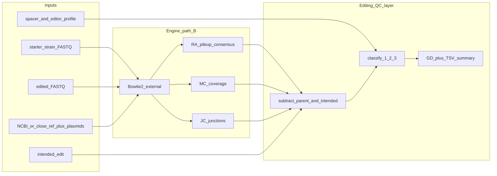

# ProkDiff 开发计划

> **给后续实现（人或 agent）：** 本目录即项目根。按阶段勾选推进；每阶段先写测试再写实现。遵守 [AGENTS.md](AGENTS.md)。
>
> 副标题（README / 论文一行）：**Prokaryotic genome diff for gene-editing QC — starter vs edited WGS**

**Goal：** 面向原核编辑 QC 的全基因组非预期变异检测器：出发株与编辑株都做 WGS；NCBI 参考只作坐标骨架；差分后的突变按三类分类。引擎对标 breseq consensus，语义对标 Widney/Copley 2024。

**Architecture：** 外部调用 Bowtie2（不重写比对器）；Rust 实现 RA / MC / JC 的克隆 consensus 子集，以钉死版本的 breseq `.gd` 为 **oracle only**。产品层对两株各自调用后做集合差，掩码目的编辑，再按 (3)→(1)→(2) 打标签。

**Tech Stack：** Rust 2021 workspace（`rust-version` 1.82+）；BAM I/O 锁定 `noodles`；系统安装 `bowtie2`；开发期钉死 **breseq 0.40.x** + 配套 bowtie2（结果 oracle + 时间/资源对照）；输出 GD 兼容子集 + TSV + 摘要。许可证建议 **MIT**（清洁室实现）。不依赖 GPU，不重写 HMMER / ESM。测试运行提交 **`qcpu_18i`**，不在登录节点跑。

## 项目名


|             |                                                                              |
| ----------- | ---------------------------------------------------------------------------- |
| 展示名         | **ProkDiff**                                                                 |
| CLI / crate | `prokdiff`（全小写、无连字符，`cargo install prokdiff`）                                |
| GitHub      | 仓库可用 `ProkDiff`，二进制一律 `prokdiff`                                             |
| 含义          | prokaryote + genome **diff**（出发株 vs 编辑株），标明原核、不是人细胞 GUIDE-seq                |
| 检索          | 机器学习里已有 **ProDiff**（无 k）。拼写必须带 k。发布前再搜 crates.io / GitHub；若占用则 `prokdiff-qc` |


名称核对（2026-08-31）：GitHub / crates.io 未见 `ProkDiff` / `prokdiff` 占用。

## Global Constraints

- 第一期仅 Illumina 短读；仅克隆 consensus。不做混群 polymorphism、长读长、GUIDE-seq。
- CLI **必须同时要出发株与编辑株 FASTQ**。仅编辑株 + NCBI → 非零退出。NCBI / 近缘基因组只作坐标骨架，不是生物学对照。
- 非预期突变 = `M_edited \ M_parent \ {intended}`（坐标与等位基因匹配后减去）。`--intended` 可选；缺省则差分后全部进非预期。
- 三类都要报。**不得按「该编辑器是否制造 DSB」关闭散在突变（class 2）。**
- 机制标签只做可选假说，不当事实。禁止默认「CAST / IS110 无 DSB / 无 SOS / 无全基因组诱变」。
- 第一期 `--editor`：`cas9` | `cas12a` | `dsb`。`cast` / `is110` 返回明确错误并指向后续路线图。
- 比对调用系统 `bowtie2`，与 breseq 一致。不重写比对器。
- **引擎锁定路径 B：** Rust 实现 RA / MC / JC；**禁止**把系统 `breseq` 当运行时引擎。breseq `.gd` 只用于对拍。
- 引擎清洁室：按 [breseq methods](https://breseq.barricklab.org/0.40.1/methods/) 实现，**不复制 breseq 源码**（GPL-2.0）。对拍须覆盖 **结果（`.gd` / SUBTRACT）+ 运行时间（wall-clock）+ 计算资源（peak RSS / CPU）**；实测写入 `benchmark/results/`，禁止臆造。
- BAM I/O 锁定 `noodles`（与 SAMRust 一致）。不引入 `rust-htslib` 除非本计划改口。
- 钉死 **breseq 0.40.x** + 配套 bowtie2，写入 `testdata/VERSIONS.txt`。不因文献复现再钉 0.35.4。
- **不把 Widney SRA（PRJNA1088182）纳入 testdata。** 该文只作科学规格。
- 不要把完整大肠 200× FASTQ 推进 git。模拟 reads 用 git-lfs 或 `testdata/generate.sh`。
- 出发株必须与编辑株同一种、同一克隆来源（编辑前那管菌）。不能用「网上另一株 MG1655 的 SRA」冒充亲本。
- **测试运行不在登录节点。** 登录节点仅 fmt / clippy / `cargo check`。凡 bowtie2、breseq、FASTQ、层 1–3、计时对照一律 `sbatch` 到 **`qcpu_18i`**，并给足 `cpus-per-task` / 内存以便与 breseq 公平对照。

---


## 1. 科学规格（不要做成细菌版 GUIDE-seq）

人细胞「脱靶」= Cas 在非目的位点切开。本工具的「脱靶/非预期」= **编辑株相对出发株**多出来的一切基因组变化（不是相对 NCBI 参考），再分类。

### 三类（观察定义）

1. **可编程近同源事件（第一期 = Cas9/Cas12 误切）**
  突变落在 spacer 近同源 + 该编辑器的 PAM 附近。Cas9 默认 NGG（可配 NAG 等）；Cas12a 默认 TTTV。用 Cas-OFFinder 规则或等价扫描做**注释**，不当唯一证据。
2. **散在点突变 / 短 indel（全基因组意外突变）**
  观察定义：差分后不属于 (1)(3) 的 RA。Widney 在 Cas9 / I-SceI 上归因于 DSB–SOS 易错复制，但那是假说。**所有编辑器都要报这一类。**
   可选假说列：Cas9 / Cas12 / `dsb` 可附注 `hypothesis:sos_widney2014`（与文献一致，仍非单克隆证明）。CAST / bRNA-IS110 标 `hypothesis:unknown_global`（可能含隐蔽断裂、单链缺口、重组中间体、未描述的修复压力）。用户可关闭假说列，只保留观察类 `scattered_snv`。
3. **结构 / 移动元件 / 质粒（JC + MC）**
  IS、大片段、质粒残留、非预期插入。CAST / bRNA-IS110 的错误靶点插入是后续近同源注释的重点，**同时仍必须扫描 (2)**，不能把「插入编辑器」简化成只看 JC。

**判定顺序（锁定）：** 先 (3) 结构 / IS / 质粒，再 (1) Cas 近同源，剩余 (2)。一条突变只进一类。

### 编辑器档案

原核常用 Cas9、Cas12；新型工具（CAST、bRNA-IS110）近同源识别规则不同，不能套 Cas PAM。WGS 差分对所有编辑器相同。散在突变是观察结果，不随编辑器开关。文献中「CAST/IS110 偏 DSB-free」只能当背景，不能当软件公理。


| 阶段  | 编辑器        | 已相对清楚的                       | 软件不得写死的                           | `--editor`         | 第一期 / 后续                                          |
| --- | ---------- | ---------------------------- | --------------------------------- | ------------------ | ------------------------------------------------- |
| 1   | Cas9       | spacer + NGG 类 PAM；常伴随 DSB   | 单次实验是否 SOS 仍靠数据                   | `cas9`             | PAM 近同源注释；(2) 必报；可附 Widney SOS 假说                 |
| 1   | Cas12a 等   | T-rich PAM（Cas12a TTTV）；交错切割 | 全基因组诱变幅度未假定为 0                    | `cas12a` + `--pam` | 同 Cas9，换 PAM                                      |
| 1   | 通用核酸酶对照    | 无 CRISPR spacer（如 I-SceI）    | 无 spacer 也可升高散在突变                 | `dsb`              | 不做 (1)；(2)(3) 全开                                  |
| 后续  | CAST       | crRNA 引导插入；近同源规则 ≠ Cas9 PAM  | 是否产生 DSB/缺口、是否激发 SOS 或其他全基因组修复：未定 | `cast`             | JC + donor + CAST 近同源；(2) 仍必报，假说 `unknown_global` |
| 后续  | bRNA-IS110 | TBL/DBL 指定靶与 donor           | 不得标成「无断裂编辑故无全基因组脱靶」               | `is110`            | JC + donor + TBL 规则；(2) 必报                        |


文献：

- Widney et al. 2024 bioRxiv [10.1101/2024.03.19.584922](https://doi.org/10.1101/2024.03.19.584922)
- breseq methods：[https://breseq.barricklab.org/0.40.1/methods/](https://breseq.barricklab.org/0.40.1/methods/)
- Deatherage & Barrick 2014（结构变异 / IS）：[PMC4239701](https://pmc.ncbi.nlm.nih.gov/articles/PMC4239701/)
- CAST：Strecker / Klompe 等 INTEGRATE；bRNA-IS110：Durrant et al. Nature 2024（bridge RNA）


## 2. 两层参考


| 层         | 用什么                                     | 不用来做什么               |
| --------- | --------------------------------------- | -------------------- |
| 比对 / 注释骨架 | NCBI 或近缘完整基因组（如 MG1655）+ 实验质粒 FASTA/GBK | 不把「相对该骨架的全部差异」当作编辑后果 |
| 生物学基线     | **出发株 WGS**（与编辑株同一批次或明确为编辑前冻存株）         | 不单独用公布基因组代替出发株       |


**差分路径（第一期，与 Widney 一致）：**

1. 出发株、编辑株都比对到同一骨架参考。
2. 各自 consensus 得到突变集 `M_parent`、`M_edited`。
3. 非预期 = `M_edited \ M_parent \ {intended}`。

**后续可选：** 先用出发株 consensus 改写参考，再只对编辑株调用。列表更干净，但注释坐标要随改写走，第一期不做。

实验室菌株相对 MG1655 等公布基因组往往已有成百上千个 SNP / indel / IS。把这些全部报成「编辑脱靶」会淹没真信号。

## 3. 架构




- **比对：** 调用系统 `bowtie2`，Rust 用 `noodles` 读 BAM。
- **突变发现：** RA / MC / JC 的 *consensus* 子集，以 breseq `.gd` 为 oracle。
- **编辑层：** 两株各自相对同一参考调用，再做集合差；掩码目的编辑；三类分类。breseq 单次 run 不会自动做「两株差分」；Widney 是把 breseq 结果进 Excel 去掉亲本已有位点。

**引擎实现（锁定路径 B）：**

- Rust 实现 RA / MC / JC，Bowtie2 外部调用。
- 运行时 **不得** shell 出 `breseq`。
- 脚注：产品层（差分 / 分类）测试可以用人造 `.gd` 夹具，不依赖引擎先完成；这不改变运行时路径。


## 4. 仓库布局

本目录（`04_ProkDiff`）即项目根。阶段 0–1 已落地（workspace + 层 0 单元测试）；阶段 2 尚未执行。

```text
04_ProkDiff/
  Cargo.toml                    # workspace（阶段 0）
  crates/prokdiff/              # CLI
  crates/prokdiff-gd/           # GD 读写 + SUBTRACT 语义
  crates/prokdiff-evidence/     # RA / MC / JC
  crates/prokdiff-classify/     # 出发株减去 + 目的掩码 + 三类标签
  crates/prokdiff-report/       # TSV + 摘要
  testdata/VERSIONS.txt         # breseq / bowtie2 精确版本
  testdata/generate.sh          # 层 1 合成 FASTQ 可复现生成
  testdata/private/             # gitignore：用户配对 WGS
  benchmark/results/            # 结果 / wall / RSS 对照表
  docs/parity.md                # 与 breseq 允许 / 不允许的差异 + 性能记录
  docs/schema.md                # CLI / intended / GD / unintended 契约
  README.md
  AGENTS.md
  DEVELOPMENT.md
  DEVELOPMENT_PLAN.md
```

目录名用连字符（与 SAMRust 一致）；Cargo 包名同目录；Rust 模块名用下划线（如 `prokdiff_evidence`）。


| crate               | 职责                                                                                                                                                |
| ------------------- | ------------------------------------------------------------------------------------------------------------------------------------------------- |
| `prokdiff`          | CLI：`--starter` / `--edited` 必填；`--ref`；`--intended`（可选）；`--editor cas9|cas12a|dsb`；`--spacer` / `--pam`；`--threads`；`--no-hypothesis`；`--outdir` |
| `prokdiff-gd`       | Genome Diff 读写（SNP/INS/DEL/MOB/JC 子集）与 `gdtools SUBTRACT` 语义的集合差。classify / report 依赖本 crate，不依赖 pileup                                           |
| `prokdiff-evidence` | pileup 共识、覆盖缺口、junction；写出与 breseq 可对拍的 GD 子集                                                                                                     |
| `prokdiff-classify` | `subtract(edited, starter)`、目的掩码、近同源扫描、三类标签                                                                                                       |
| `prokdiff-report`   | `unintended.tsv`、摘要、可选 HTML                                                                                                                       |


## 5. 输入 / 输出 schema

完整契约见 [docs/schema.md](docs/schema.md)。摘要如下。

### CLI（第一期）

```text
prokdiff \
  --starter starter_R1.fastq.gz --starter starter_R2.fastq.gz \
  --edited  edited_R1.fastq.gz  --edited  edited_R2.fastq.gz \
  --ref     NC_000913.3.gbk \
  --ref     plasmid.gbk \
  --intended intended.tsv \
  --editor cas9 \
  --spacer  NNNNNNNNNNNNNNNNNNNN \
  --pam     NGG \
  --threads 8 \
  --outdir  results/prokdiff
```

- `--starter` / `--edited`：可重复。**同一选项连续两个文件 = 一对 PE**（先 R1 后 R2）；单个文件 = SE；也可多 lane（多对）。缺任一株则非零退出，错误信息写明必须提供出发株 WGS。
- `--ref`：可重复。染色体 + 质粒 + donor 骨架都进同一套参考。
- `--intended`：**可选**。缺省则差分后全部进非预期。坐标相对骨架参考。
- `--editor dsb`：不做 class (1)，不要求 `--spacer`。
- `--threads`：传给 Bowtie2 / 并行 pileup。
- `--no-hypothesis`：输出不含假说列。
- 缺出发株时 **不得** 静默把相对 NCBI 的全部 SNP 当非预期。


### 引擎中间：GD 兼容子集

每个样本写出 `starter.gd` / `edited.gd`。对拍：

```text
gdtools SUBTRACT rust.gd breseq.gd   # 应为空（无多报）
gdtools SUBTRACT breseq.gd rust.gd   # 应为空（无漏报）
```

产品层金标准：`gdtools SUBTRACT edited.gd starter.gd`，再减去 intended，与 `unintended.tsv` 一致（允许 [docs/parity.md](docs/parity.md) 中的规范化差异）。

## 6. 第一期流水线

1. 可选 Fastp 式质控（或要求用户预清洗）。第一期可不内置 Fastp，文档要求 Q 过滤后的 FASTQ。
2. Bowtie2 分别比对出发株与编辑株到同一套「骨架染色体 + 辅助质粒 + donor 骨架」。缺出发株 FASTQ 则不能进入突变报告。
3. 覆盖建议约 40–80×（breseq 对 SV 约 >40×；过高拖慢且收益小）。
4. 对每个样本跑 consensus：RA（点突变 / ≤2 bp indel）+ MC + JC。
5. **差分（强制）：** `M_edited` 减去 `M_parent`，再减去 intended（若提供）。
6. **分类：**
  - (3) MOB / JC、大 DEL、质粒拷贝数 / 丢失。
  - (1) 仅当 `--editor` 为 cas9/cas12a：距最近预测近同源（该 PAM 规则）≤ 默认 50 bp。
  - (2) 其余散在 RA：观察类一律 `scattered_snv`。可选假说：cas9/cas12a/dsb → `sos_widney2014`；后续 cast/is110 或未知 → `unknown_global`。**从不因编辑器类型省略 (2)。**
7. 输出：`unintended.tsv`、GD 子集、摘要。


## 7. 测试数据与和 breseq 对齐

原则：**breseq 是突变发现引擎的 oracle 与性能对照**（同一参考、同一 FASTQ、同一计算节点、钉死版本）。对拍三维：**结果 + 时间 + 资源**。产品层（出发株差分、三类分类）用合成双样本，不要求 breseq 自己会做「两株相减」。比对器也钉死，否则 RA/JC 会对不齐。

**执行环境（强制）：**

- 登录节点：只做编辑与静态检查（fmt / clippy / check）。**禁止**在此跑测试运行。
- 层 1 / 层 2 / 层 3、以及任何调用 bowtie2 或 breseq 的对拍与计时：提交 Slurm 分区 **`qcpu_18i`**，申请足够 CPU 与内存（与 `--threads` / breseq `-j` 对齐），避免欠申请导致假失败或不公平对照。
- 实测表写入 `benchmark/results/`（见 [docs/parity.md](docs/parity.md)）。

### 层 0 — 无 FASTQ 的单元测试（CI 默认跑）

- 人造 pileup 列：共识 SNP、1–2 bp indel、链偏倚应滤掉的位点。
- 人造 mosaic 比对：应接受 / 拒绝的 JC（skew、双链、最小 overlap 按 methods）。
- GD 解析与 `gdtools SUBTRACT` 语义的集合差。
- 不依赖网络、不下载 SRA；不调用 bowtie2 / breseq。
- 可在 CI 跑；登录节点仅允许极短纯内存用例。有外部依赖则改走队列。

### 层 1 — 合成基因组（引擎对齐 + 产品差分）

用参考 FASTA（可截一段大肠 ~200 kb 以加快迭代）+ `gdtools APPLY` 或等价脚本写入已知突变，再用 ART / InSilicoSeq 模拟 Illumina（定种子）。**一律在 `qcpu_18i` 上跑。**

| 夹具 | 做法 | 通过标准 |
| --- | --- | --- |
| `synth_snp_indel` | 参考上 5 个 SNP + 2 个短 indel | 与同数据 breseq `.gd` 的 SNP/INS/DEL 集合一致；同节点记录双方 wall / peak RSS |
| `synth_is_mob` | 模拟 IS 插入（参考里已有 IS 拷贝） | MOB/JC 不漏报；允许 junction 坐标 ± 数 bp 的规范化说明；记时间与资源 |
| `synth_parent_child` | 出发株 FASTQ = 参考+50 个历史 SNP；编辑株 = 再加 1 个远距 SNP + 1 个 IS + 目的编辑 | 非预期列表只有后 2 类事件（目的编辑被掩码）；50 个历史 SNP 不得出现 |
| `synth_cas9_near` | 在 NGG 近同源处放 1 个 SNP | 标 class (1)；`dsb` 模式不标 (1) |

### 层 2 — 官方真实数据（发布前 / `slow`；必须队列）

1. **Test Drive**
   参考 `NC_012967`（REL606）；reads [SRR030257](https://www.ebi.ac.uk/ena/browser/view/SRR030257)（LTEE 2 万代，Barrick 2009）。命令：`breseq -r NC_012967.gbk SRR030257_*.fastq.gz`。说明：单样本相对祖先参考，**不是**出发株 vs 编辑株；只测引擎结果与性能。
2. **Methods Mol. Biol. 2014 教程包**（[Barrick 下载页](https://barricklab.org/twiki/bin/view/Lab/ToolsBacterialGenomeResequencing)）
   `Clonal_Sample.tgz`（~267 MB 输入）+ `Clonal_Output.tgz`（期望输出）。优先把 `output.gd` 当金标准；同节点对照 ProkDiff wall / RSS。
3. **Junction / cassette**（同页 Example 6）
   *A. baylyi* + 整合 cassette：专门压 JC。第一期 IS/cassette 对齐不可省。

第一期 **不**把 `Population_Sample.tgz` 当必过。

**不使用** Widney/Copley 2024 的 SRA（PRJNA1088182）或补充表作为测试 / 金标准。

### 层 3 — 实验室真实配对（可不公开）

已有 breseq 结果的「出发株 + 编辑株」各跑一次，导出两个 `.gd`，`gdtools SUBTRACT edited.gd starter.gd` 作为产品层金标准。数据留在 `testdata/private/`（gitignore）。引擎侧仍在队列上与同机 breseq 比时间与资源。

### 与 breseq 一致的判定

详见 [docs/parity.md](docs/parity.md)。摘要：

- **结果允许：** UN / 未知区、HTML、R 图、BAM 文件名；重复区 JC 拷贝歧义；consensus 频率舍入。
- **结果不允许：** SNP 位点 / 等位基因不一致；明确的 unique-mapping MOB / 大 DEL 漏报。
- **时间与资源：** 同节点、同数据必测；数字进 `benchmark/results/`；不在文档里写死「快 N×」。

### CI 与 HPC

- GitHub CI / PR：层 0 纯内存单元（无 bowtie2/breseq）。
- 本机开发：层 1 全套、层 2、计时对照 → **`qcpu_18i`**，给足资源。
- 发版前：层 2 Test Drive 或 Clonal_Output 全量；记录 breseq 与 bowtie2 版本哈希 + 结果/时间/资源表。


## 8. 分阶段任务


### 阶段 0 — 仓库脚手架

- [x] `git init` + Cargo workspace（五个 crate：`prokdiff` / `prokdiff-gd` / `prokdiff-evidence` / `prokdiff-classify` / `prokdiff-report`）。
- [x] `testdata/VERSIONS.txt` 写入本机 `breseq --version` 与 `bowtie2 --version`（当前 env：breseq 0.39.0 + bowtie2 2.5.4；目标钉仍为 0.40.x）。
- [x] `testdata/private/` 加入 `.gitignore`；大 FASTQ 不进 git。
- [x] 确认 README / AGENTS / DEVELOPMENT / schema / parity 已就绪。


### 阶段 1 — GD I/O 与证据单元测试（层 0）

- [x] `prokdiff-gd`：SNP/INS/DEL/MOB/JC 最小子集读写。
- [x] 实现与 `gdtools SUBTRACT` 一致的集合差（坐标 + 类型 + 等位基因）。
- [x] pileup 共识单元测试：SNP、1–2 bp indel、链偏倚过滤（可先测后接 evidence）。
- [x] JC 接受 / 拒绝规则的单元测试（无 FASTQ）。


### 阶段 2 — 引擎 MVP（路径 B）

- [ ] 包装 Bowtie2：两样本分别比对到同一 `--ref` 集合，产出 BAM（`noodles` 读）。
- [ ] RA：并行 pileup（针对 breseq 最慢的 examining read alignment evidence）。
- [ ] MC：覆盖缺口 / 大 DEL。
- [ ] JC：新连接；IS / cassette 不可砍。工期紧则 JC 二次比对可后做，但层 1 `synth_is_mob` 必须能报。
- [ ] 层 1 `synth_snp_indel` 在 **`qcpu_18i`** 与同机 breseq：双向 SUBTRACT 为空（parity 允许范围内）+ 记录双方 wall-clock 与 peak RSS。
- [ ] 提交脚本模板：`scripts/submit_parity_*.sh`（给足 `cpus-per-task` / mem）。


### 阶段 3 — 产品层：差分 + 三类

- [ ] `--starter` / `--edited` 必填校验；PE 配对规则；`--intended` 可选。
- [ ] `subtract` + intended 掩码；层 1 `synth_parent_child`：50 个历史 SNP 不得出现在非预期列表。
- [ ] Cas9 NGG / Cas12a TTTV 近同源扫描（`--pam` 可覆盖）；默认 50 bp。
- [ ] `synth_cas9_near`：cas9 标 `near_homolog`，`dsb` 不标 (1)，该 SNP 仍出现在 (2)。
- [ ] 判定顺序 (3)→(1)→(2)；假说列可关。


### 阶段 4 — 报告与真实数据

- [ ] `unintended.tsv` + `summary` + 两个 `.gd`。
- [ ] 层 2：Test Drive 或 Clonal_Output；Example 6 cassette（均在 **`qcpu_18i`**，给足资源）。
- [ ] 层 3：用户私有配对（若有）。
- [ ] 同节点三维对照表（结果 / wall / RSS）写入 `benchmark/results/`；先测再写 README，不在规格里写死加速比。


### 阶段 5 — 明确非目标（第一期不做）

- CAST / bRNA-IS110 专用近同源与 donor 解释（做的时候 (2) 仍必开，假说 `unknown_global`）。
- Polymorphism / 时间序列；长读长；HTML 覆盖图。
- 内置组装；重写 Bowtie2 / HMMER / ESM。
- 运行时包装系统 `breseq` 当引擎。


## 9. 成功标准（第一期）

- 克隆编辑株：能输出「目的编辑成功与否 + **相对出发株**的非预期列表 + 三类计数」。
- 合成夹具：三类标签正确；出发株相对 NCBI 的历史变异与目的编辑均不出现在非预期列表。
- 真实 breseq 克隆样本：JC/MOB 不系统性漏报。
- 同节点同数据：相对 breseq 有可复核的 **结果对拍 + wall-clock + peak RSS** 记录（`benchmark/results/`）；总时间可接受或更快（倍数以实测为准，不写死）。
- 开发期测试运行均经队列提交，未在登录节点跑 bowtie2 / breseq / 层 1+ 负载。

