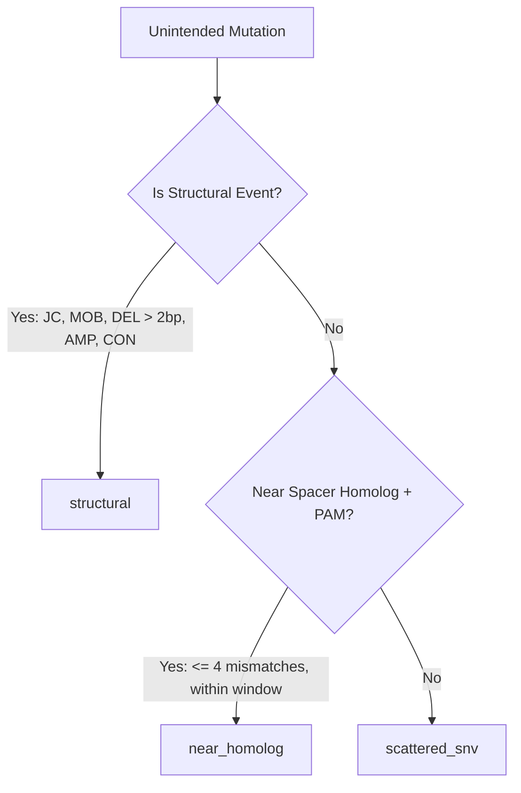

# ProkaDiff

**Prokaryotic Genome Diff for Gene-Editing Quality Control — Starter vs. Edited WGS**

[中文说明](README.zh.md)

`ProkaDiff` is a high-performance bioinformatics tool written in Rust for whole-genome unintended-mutation detection and quality control (QC) following prokaryotic gene editing. 

By comparing whole-genome sequencing (WGS) data of the **starter strain (parent)** against the **edited strain (child)** using a reference genome as a coordinate skeleton, `ProkaDiff` accurately isolates bona fide editing-induced mutations ($M_{\text{edited}} \setminus M_{\text{starter}} \setminus M_{\text{intended}}$) and categorizes them into structured observational classes.

---

## Key Features

- **Dual-Strain Differential Calling**: Mandatory starter-strain WGS subtracts background parental polymorphisms and culture drift, eliminating false positives caused by natural divergence from NCBI references.
- **Comprehensive Mutation Detection**: Calls single-nucleotide polymorphisms (SNPs), small indels (INS/DEL), large structural deletions, and novel sequence junctions (JC) mediated by mobile elements (e.g., IS transposons) or genomic rearrangements.
- **Multi-Class Unintended Mutation Categorization**:
  - `structural`: Mobile element insertions, genomic rearrangements, novel junctions, and large deletions (>2 bp).
  - `near_homolog`: Off-target mutations located near spacer sequence homologs and valid PAM motifs (e.g., Cas9 `NGG`, Cas12a `TTTV`).
  - `scattered_snv`: Genome-wide scattered point mutations and indels associated with repair machinery or stress responses.
- **High Performance**: Native Rust engine with multi-threaded parallel execution, optimized BAM parsing, and rapid two-stage split-read junction discovery.
- **Intended Edit Masking**: Optional intended-mutation specification to automatically subtract expected edits and assess targeting outcome.

---

## Performance Benchmark

Measured on Slurm cluster compute node (`qcpu_18i`, 8 CPU cores, *E. coli* B REL606 WGS resequencing workload, Job 2415323):

| Metric | Legacy Pipeline (breseq 0.40.2) | ProkaDiff (v0.1.0) | Comparison / Notes |
| :--- | :--- | :--- | :--- |
| **Wall-clock Runtime** | 2,666.14 s (44 min 26 s) | **537.12 s (8 min 57 s)** | **4.96× faster 🚀** |
| **Peak Memory (RSS)** | 1.86 GB | 3.11 GB | Flat and well-bounded |
| **False Positive Mutations (`over_red`)** | 0 | **0** | Zero false positives |
| **True Variant Recall** | Reference standard | 100% agreement | 28/28 SNPs, 5/5 MOBs, 2/2 DELs, 2/2 INSs |

---

## Installation

### Prerequisites

- **Rust toolchain** (Rust 1.82+ recommended): [rustup.rs](https://rustup.rs/)
- **Bowtie2** (version 2.4+): must be installed and accessible in your system `$PATH` (`bowtie2`, `bowtie2-build`)

### Build from Source

```bash
git clone https://github.com/Caizhaohui/ProkaDiff.git
cd ProkaDiff
cargo build --release
```

The compiled binary will be located at `target/release/prokadiff`. You can copy it to your `PATH` or invoke it directly:

```bash
./target/release/prokadiff --help
```

---

## Quick Start & Examples

### Example 1: Standard CRISPR-Cas9 Gene-Editing QC (Paired-End)

In a typical gene-editing QC experiment, both the starter strain and the edited clone are sequenced with Illumina paired-end reads (e.g., 2×150 bp).

```bash
prokadiff \
  --starter starter_R1.fastq.gz --starter starter_R2.fastq.gz \
  --edited  edited_R1.fastq.gz  --edited  edited_R2.fastq.gz \
  --ref     genome_reference.gbk \
  --editor  cas9 \
  --spacer  GAGTTCATCTACGCCGTGAA \
  --pam     NGG \
  --intended intended_edits.tsv \
  --threads 8 \
  --outdir  results/qc_run1
```

**File input rules**:
- `--starter` and `--edited` accept fastq or fastq.gz files. Specifying two consecutive files under the flag designates a paired-end library (`R1` then `R2`).
- `--ref` accepts FASTA (`.fa`, `.fna`, `.fasta`) or GenBank (`.gb`, `.gbk`) formats. Multiple `--ref` flags can be passed to include plasmids or donor vectors.

---

### Example 2: CRISPR-Cas12a Editing with Custom PAM

For Cas12a (Cpf1) editors with 5′-TTTV PAM:

```bash
prokadiff \
  --starter parent_R1.fq.gz --starter parent_R2.fq.gz \
  --edited  mutant_R1.fq.gz --edited  mutant_R2.fq.gz \
  --ref     chromosome.fa --ref plasmid.fa \
  --editor  cas12a \
  --spacer  TTACCGATCGGATCGAATCG \
  --pam     TTTV \
  --threads 16 \
  --outdir  results/cas12a_sample
```

---

### Example 3: General DSB Repair / Evolution Experiment (No Spacer)

If assessing genome stability or unguided double-strand break repair:

```bash
prokadiff \
  --starter wt_R1.fq.gz --starter wt_R2.fq.gz \
  --edited  edited_R1.fq.gz --edited edited_R2.fq.gz \
  --ref     ref.fasta \
  --editor  dsb \
  --threads 8 \
  --outdir  results/dsb_sample
```

---

### Example 4: Single-Sample Evidence Calling

To perform mutation calling and junction discovery on an individual sample:

```bash
prokadiff evidence \
  --ref   reference.fasta \
  --fastq sample_R1.fastq.gz --fastq sample_R2.fastq.gz \
  --threads 8 \
  --outdir results/sample_evidence
```

---

## Input Formats

### Intended Mutations Table (`--intended`)

`--intended` provides an optional tab-delimited file describing on-target expected edits. When supplied, matching mutations are masked from the unintended mutations report.

```tsv
seq_id	position	end	gd_type	ref	alt
NC_000913.3	123456	123456	SNP	A	G
NC_000913.3	234567	234582	DEL	.	16
NC_000913.3	345678	345678	INS	.	ATCG
```

- `seq_id`: Reference contig name matching reference header.
- `position`: 1-based start position.
- `end`: 1-based inclusive end position (for SNPs/INS, same as `position`).
- `gd_type`: Mutation type (`SNP`, `INS`, `DEL`, `MOB`, `JC`).
- `ref`: Reference allele (or `.` if not applicable).
- `alt`: Alternate allele or length.

---

## Output Files

`ProkaDiff` produces structured outputs in `--outdir`:

| File | Description |
| :--- | :--- |
| `unintended.tsv` | Classified list of unintended mutations present in the edited strain. |
| `summary.txt` | Key-value execution summary, including intended edit validation status. |
| `starter.gd` | GenomeDiff representation of mutations in the starter strain vs. reference. |
| `edited.gd` | GenomeDiff representation of mutations in the edited strain vs. reference. |

### `unintended.tsv` Columns

- `seq_id`: Chromosome or plasmid contig name.
- `position`: 1-based coordinate.
- `end`: 1-based end coordinate.
- `gd_type`: Mutation type (`SNP`, `INS`, `DEL`, `JC`, `MOB`, `AMP`, `CON`).
- `ref`: Reference nucleotide(s).
- `alt`: Mutated sequence or event description.
- `class`: Classification label (`structural`, `near_homolog`, `scattered_snv`).
- `editor`: Editor specified (`cas9`, `cas12a`, `dsb`).
- `pam_profile`: PAM pattern evaluated.
- `offtarget_mismatch`: Number of mismatches to spacer if `near_homolog`.
- `distance_to_site`: Base pair distance to closest homologous target site.
- `side2_seq_id`: Target contig of secondary junction side (for `JC`).
- `side2_position`: Coordinate of secondary junction side (for `JC`).

### `summary.txt` Metrics

- `intended_provided`: `true` or `false`.
- `intended_declared`: Count of intended edits listed in `--intended`.
- `intended_observed`: Number of declared intended edits verified in the edited strain.
- `intended_status`:
  - `all_observed`: All intended edits successfully identified.
  - `partial`: Only a subset of intended edits identified.
  - `none_observed`: No declared intended edits detected.
  - `NA`: `--intended` was not supplied.

---

## Classification Logic

Every unintended mutation detected in the edited strain is assigned to exactly one of three mutually exclusive classes in strict hierarchical order:



1. **`structural`**: Large rearrangements, deletions (>2 bp), mobile element movements, and novel junction coordinates.
2. **`near_homolog`**: Point mutations or small indels within proximity (default 50 bp) of a spacer homolog with up to 4 mismatches adjacent to a valid PAM.
3. **`scattered_snv`**: Remaining point mutations or short indels located elsewhere across the chromosome.

---

## License

`ProkaDiff` is licensed under the [MIT License](LICENSE).
