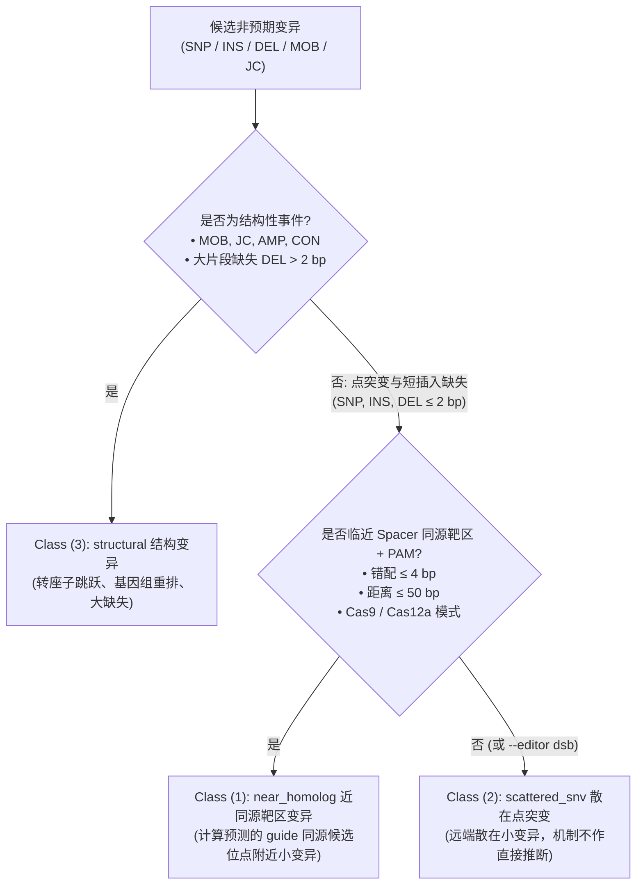

<p align="center">
  
</p>

# ProkaDiff

**面向原核工程菌株的全基因组编辑审计与验证工具：出发株 vs 编辑株 WGS**

[English README](README.md) | [科学解释模型与证据规范](docs/scientific_model.md)

`ProkaDiff` 是一款基于 Rust 构建的高性能、WGS-first 生物信息学框架，专为原核生物（细菌、放线菌等）基因编辑后的**全基因组编辑验证与完整性审计**（Post-edit Genome Audit & Edit Verification）而设计。

### 核心回答的两个基本问题

当实验人员测序并评估一个工程菌株时，`ProkaDiff` 直接给出客观解答：
1. **预期的目标编辑是否成功？** 基因组结构是完整、部分达成还是发生了异常重排？
2. **整个基因组除此之外还发生了什么？** 伴生的全基因组差分变异有哪些，其与编辑系统及序列环境的机制关联是什么？

### 观察优先的分析流向（Observation-First）

`ProkaDiff` 严格遵守观察优先的工作流，彻底分离客观观察事实与生物学机制假说：
```text
测序直接观察变异 (出发株 vs 编辑株 WGS 双株差分)
        ↓
预期编辑深度验证 (Complete / Partial / Missing / UnexpectedStructure)
        ↓
全基因组结构与元件注释 (CDS 基因区、IS 移动元件跳跃、重复区、大结构变异)
        ↓
机制与同源关联分析 (候选向导依赖误切关联、附带突变与应激分析)
        ↓
人类可读全基因组审计报告 (report.md 高管摘要、审查优先级与局限性声明)
```

---

## 核心特性

- **双株差分比对基线**：强制要求输入出发亲本株与编辑株 WGS 测序数据，彻底剥离背景遗传多态性与培养传代漂移，消除因 NCBI 参考基因组自然分化导致的数千个假阳性。
- **预期编辑深度验证**：对声明的编辑进行严格结构化断点与接头闭环检验（`Complete` 完整、`Partial` 部分、`Missing` 缺失、`UnexpectedStructure` 异常结构），杜绝简单掩盖。
- **全谱系变异检出能力**：
  - 单核苷酸多态性（SNP）与小片段插入/缺失（INS/DEL）。
  - 大片段结构性缺失（DEL）与物理覆盖缺口。
  - 插入序列（IS）跳跃形成的移动元件变异（MOB）与新型结构连接（JC）。
- **正交多维注释体系**：
  - `structural`（结构变异）：转座元件插入（IS/MOB）、基因组重排、断点接头及大片段缺失（>2 bp）。
  - `candidate guide-dependent`（候选向导依赖）：位于计算预测的 guide 同源候选位点及有效 PAM 附近的小变异。
  - `collateral / distal`（附带/散在变异）：远离候选靶点的散在点突变及短 indel（培养漂移、代谢/复制压力或自发突变）。
- **严格遵守证据四层级**：Level 0（直接观察） $\to$ Level 1（上下文关联） $\to$ Level 2（机制假说） $\to$ Level 3（实验因果），详见 [docs/scientific_model.md](docs/scientific_model.md)。
- **人类可读审计报告**：除生成标准机器可读 TSV 表格之外，默认交付实验人员可直接审阅决策的 `report.md` 高管摘要报告。

---

## 基准证据（Benchmark Evidence）

只有 [`benchmark/results/verified/`](benchmark/results/verified/) 下的紧凑记录可作为可发布的基准证据。每条记录只能由 `qcpu_18i` 上的同一个 Slurm 作业产生：该作业必须完成双向 Genome Diff 对比，并同时采集 ProkaDiff 与 breseq 的 wall-clock 和 peak RSS。

### 官方 Clonal 对拍与性能基准（[作业 2424014](benchmark/results/verified/clonal_2424014.md)）

- **评测数据集**：大肠杆菌 *E. coli* B REL606 Clonal Sample（760 万条 $2 \times 36$ bp 双端测序读段，Methods Mol. Biol. 2014）
- **评测环境**：Slurm 分区 `qcpu_18i`，计算节点 `bnode29`，统一分配 8 线程（`--threads 8` / `breseq -j 8`）
- **对拍 Oracle**：breseq 0.40.2 + bowtie2 2.5.4（[VERSIONS.txt](testdata/VERSIONS.txt) 锁定版本）

| 工具 | 壁钟耗时 (Wall clock) | 内存峰值 (Peak RSS) | 对拍质量 (vs Oracle) | 实测加速比 |
| :--- | :---: | :---: | :--- | :---: |
| **ProkaDiff** `v0.1.0` | **544.55 秒** (9分04秒) | 3.27 GB (3,432,960 kB) | **0 假阳性** (`over_red = 0`)，MOB 100% 召回 (5/5) | **5.69×** |
| **breseq** `0.40.2` | 3,098.01 秒 (51分38秒) | 1.77 GB (1,856,948 kB) | 官方基准对照 Oracle | 1.00× |

---

## 安装与配置

### 环境依赖

- **Rust 编译环境**（推荐 1.82+）：[https://rustup.rs/](https://rustup.rs/)
- **Bowtie2**（2.4+）：系统 `$PATH` 需可直接调用 `bowtie2` 与 `bowtie2-build`

### 源码编译安装

```bash
git clone https://github.com/Caizhaohui/ProkaDiff.git
cd ProkaDiff
cargo build --release
```

编译产物位于 `target/release/prokadiff`。可将其加入环境变量路径或直接运行：

```bash
./target/release/prokadiff --help
```

---

## 快速上手与典型实例

### 实例 1：标准 CRISPR-Cas9 基因编辑全基因组 QC（双端测序）

在常规基因编辑质控实验中，同时对出发亲本株和编辑克隆株进行 Illumina 双端测序（如 2×150 bp）：

```bash
prokadiff \
  --starter starter_R1.fastq.gz --starter starter_R2.fastq.gz \
  --edited  edited_R1.fastq.gz  --edited  edited_R2.fastq.gz \
  --ref     genome_reference.gbk \
  --editor  cas9 \
  --spacer  GAGTTCATCTACGCCGTGAA \
  --pam     NGG \
  --intended intended_edits.tsv \
  --threads 8 \
  --outdir  results/qc_run1
```

**输入参数规则**：
- `--starter` 和 `--edited` 支持 fastq 或 fastq.gz 格式。同一参数连续指定两个文件时，自动识别为一对双端文库（先 R1 后 R2）。
- `--ref` 支持 FASTA（`.fa`, `.fasta`, `.fna`）或 GenBank（`.gb`, `.gbk`）格式，允许多次指定以包含质粒或供体载体序列。
- 所有 `--ref` 输入中的 contig ID 必须全局唯一。同一多记录 FASTA/GenBank 文件内或不同参考文件之间如有重复，程序会在 Bowtie2 启动前失败，并报告重复 ID 与两条来源路径。

---

### 实例 2：CRISPR-Cas12a（Cpf1）系统质控（自定义 PAM）

针对使用 5′-TTTV PAM 的 Cas12a 系统：

```bash
prokadiff \
  --starter parent_R1.fq.gz --starter parent_R2.fq.gz \
  --edited  mutant_R1.fq.gz --edited  mutant_R2.fq.gz \
  --ref     chromosome.fa --ref plasmid.fa \
  --editor  cas12a \
  --spacer  TTACCGATCGGATCGAATCG \
  --pam     TTTV \
  --threads 16 \
  --outdir  results/cas12a_sample
```

---

### 实例 3：常规双链断裂（DSB）修复或适应性进化实验（无需 spacer）

适用于评估基因组自发突变率、无向双链断裂修复或非靶向质控：

```bash
prokadiff \
  --starter wt_R1.fq.gz --starter wt_R2.fq.gz \
  --edited  edited_R1.fq.gz --edited edited_R2.fq.gz \
  --ref     ref.fasta \
  --editor  dsb \
  --threads 8 \
  --outdir  results/dsb_sample
```

---

### 实例 4：单样本变异与断点挖掘引擎

如果需要对单个样本独立运行比对、变异检测与结构断点挖掘：

```bash
prokadiff evidence \
  --ref   reference.fasta \
  --fastq sample_R1.fastq.gz --fastq sample_R2.fastq.gz \
  --threads 8 \
  --outdir results/sample_evidence
```

---

## 输入文件规范

### 预期编辑声明表（`--intended`）

可选的制表符分隔（TSV）文件，用于声明预期的编辑设计。吻合的变异将被自动标记并在非预期突变列表中屏蔽。

```tsv
seq_id	start	end	kind	ref	alt
NC_000913.3	123456	123456	snp	A	G
NC_000913.3	234567	234582	del	.	16
NC_000913.3	345678	345678	ins	.	ATCG
```

- `seq_id`：参考基因组 contig 名称。
- `start`：1-based 起始物理坐标（`position` 仅作为兼容旧字段别名保留）。
- `end`：1-based 包含性终止物理坐标（点突变及单点插入与 `start` 一致）。
- `kind`：变异类别（`snp`, `sub`, `del`, `ins`, `cassette`；`gd_type` 仅作为兼容旧字段别名保留）。
- `ref`：参考碱基（不适用填 `.`）。
- `alt`：变异等位碱基或缺失长度。

---

## 输出结果解析

运行完成后，在 `--outdir` 目录下输出以下标准文件：

| 输出文件 | 说明 |
| :--- | :--- |
| `unintended.tsv` | 核心交付物：编辑株中检测出的所有非预期突变及其分类明细表。 |
| `summary.txt` | 汇总报表：记录分析配置、检出变异统计及预期编辑达成状态。 |
| `starter.gd` | 出发株相对参考基因组的 GenomeDiff 变异集。 |
| `edited.gd` | 编辑株相对参考基因组的 GenomeDiff 变异集。 |

### `unintended.tsv` 字段说明

- `seq_id`：染色体或质粒序列名称。
- `position`：变异起始坐标（1-based）。
- `end`：变异终止坐标（1-based）。
- `gd_type`：突变类型（`SNP`, `INS`, `DEL`, `JC`, `MOB`, `AMP`, `CON`）。
- `ref`：参考碱基序列。
- `alt`：变异序列或变异特征。
- `class`：三级分级标签（`structural`, `near_homolog`, `scattered_snv`）。
- `editor`：指定的编辑器类型。
- `pam_profile`：判定的 PAM 模体。
- `offtarget_mismatch`：近同源位点与 spacer 的错配碱基数。
- `distance_to_site`：突变位点距离同源靶标核心的物理距离（bp）。
- `side2_seq_id`：新型连接（JC）对侧的染色体名称。
- `side2_position`：新型连接（JC）对侧的物理坐标。

### `summary.txt` 关键指标

- `intended_provided`：是否提供了预期编辑表（`true` / `false`）。
- `intended_declared`：声明的预期编辑条目数。
- `intended_observed`：在编辑株中成功观察并匹配到的预期突变数。
- `intended_status`：
  - `all_observed`：所有声明的预期突变均成功检出。
  - `partial`：仅部分预期突变检出。
  - `none_observed`：未检出任何声明的预期突变。
  - `NA`：未提供 `--intended` 参数。

---

## 变异类型识别与分级分类逻辑（Classification Logic）

`ProkaDiff` 严格区分底层的**变异分子类型判定**（`gd_type`）与上层的**生物学成因归类**（`class`）。

### 1. 检出的变异分子类型（`gd_type`）

经过出发株背景差分（$M_{\text{edited}} \setminus M_{\text{starter}}$）与目标编辑掩膜（$\setminus M_{\text{intended}}$）后，所有保留的非预期突变均具有明确的分子类型定义：

| 突变类型 (`gd_type`) | 生物学含义 | 检出引擎路径 |
| :--- | :--- | :--- |
| **`SNP`** | 单核苷酸点突变（单碱基置换） | 并行共识 Pileup（`RA`） |
| **`INS`** | 短片段序列插入（$\le 2$ bp） | 局域读段对齐比对（`RA`） |
| **`DEL`** | 序列缺失：短缺失（$\le 2$ bp）或大片段结构缺失（> 2 bp） | `RA`（$\le 2$ bp） / 物理覆盖度缺口 `MC`（> 2 bp） |
| **`MOB`** | 移动元件转座插入（如 IS150、IS186 转座子跳跃伴随靶标位点重复 TSD） | 成对接合点拓扑聚类（`JC` + GenBank Repeat 索引） |
| **`JC`** | 新型序列接头 / 染色体重排、倒位与大片段断点 | 两阶段未比对超敏嵌合对齐断点挖掘（`JC`） |
| **`AMP` / `CON`** | 基因拷贝扩增或序列基因转换 / 替换 | 证据层综合判定 |

---

### 2. 三级不可逆分级归类（`class`）

无论突变是 `SNP`、`INS`、`DEL`、`MOB` 还是 `JC`，都会严格按照以下优先顺序，进入且仅进入一个归属类别：



1. **`structural`（第 3 类：结构变异）**：
   - 囊括所有大尺度结构变异：**新型染色体接合点（`JC`）**、**转座子插入（`MOB`）**、**拷贝扩增（`AMP`）**、**序列替换（`CON`）** 以及 **大片段缺失（`DEL` > 2 bp）**。
   - 处于最高判定优先级，避免染色体结构倒位或转座断点被片面误报为孤立点突变。
2. **`near_homolog`（第 1 类：近同源靶区变异）**：
   - 涵盖位于计算预测同源候选位点（与 spacer 错配 $\le 4$ bp 且临近有效 PAM）周围窗口（默认 $\le 50$ bp）内的**点突变（`SNP`）**与**短插入缺失（`INS`, `DEL` $\le 2$ bp）**。
   - **注意**：计算预测的临近关系不代表已验证的真实切割事件；确认因果关系需结合生化或细胞学实验（如 GUIDE-seq、CIRCLE-seq 等）验证。
3. **`scattered_snv`（第 2 类：全基因组散在变异，历史沿用名称）**：
   - 涵盖所有远离计算预测同源靶点的**散在点突变（`SNP`）**与**微小插入缺失（`INS`, `DEL` $\le 2$ bp）**。
   - 仅从二代高通量测序数据无法直接推断具体的生物学诱发机制，可能包括全基因组自发突变、克隆传代背景漂移或应激响应等；假说列仅供探索性参考，不作为事实结论。
   - 在 `--editor dsb`（非导向双链断裂）模式下，所有非结构变异直接归入此类。

---

## 软件许可

`ProkaDiff` 遵循开源 [MIT License](LICENSE)。
